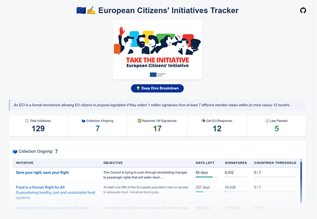

# 🇪🇺📊 ECI Initiatives Radar — Dashboard

   
  Interactive dashboard tracking ECI statuses, Commission responses, and legislative follow-ups.

A static dashboard tracking [**European Citizens' Initiatives (ECIs)**](https://citizens-initiative.europa.eu/index_en) — their status, Commission responses, and legislative follow-ups.

The content of this repository is **auto-generated** every Saturday by the [eci-initiatives-radar-pipeline](https://github.com/Luk-kar/eci-initiatives-radar-pipeline) and published here via automated Pull Request.

## What this repository contains

- The fully rendered static website (`index.html` + assets)
- Generated Plotly charts, KPI counters, and initiative tables
- Published via [**GitHub Pages**](https://luk-kar.github.io/eci-initiatives-radar/)

> For architecture details, data sources, and how to run the pipeline locally,
> see the [pipeline repository README](https://github.com/Luk-kar/eci-initiatives-radar-pipeline).
